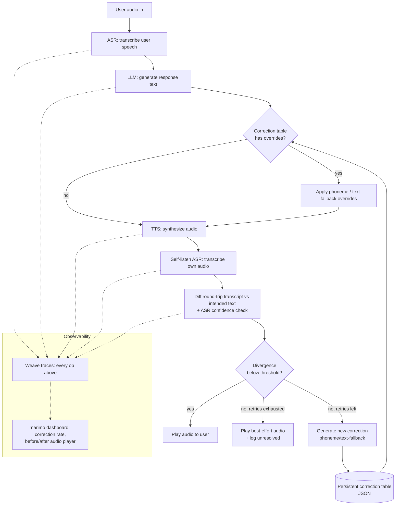

# Self-Correcting Voice Agent — CoreWeave Hacks (Sep 12-13, 2026)

A voice agent that verifies its own spoken output by listening to itself,
catching pronunciation errors before the user hears them, and permanently
fixing them so it never makes the same mistake twice.

## The loop

1. **User speaks** → ASR transcribes → LLM generates a text response.
2. **TTS synthesizes** the response into audio.
3. **Self-listen step:** feed that synthesized audio back through ASR (or a
   forced-alignment/confidence model) to get a "what a listener would
   actually hear" transcript.
4. **Compare** the round-trip transcript against the intended text:
   - Word-level diff (Levenshtein / WER via `jiwer`)
   - Flag mispronunciations of names, numbers, acronyms, domain terms
   - Flag low ASR confidence spans (indicates ambiguous/mumbled audio)
5. **Decision gate:**
   - Divergence below threshold → play audio to user, log success.
   - Divergence above threshold → don't play it yet. Instead:
     - Rewrite the response using a correction (SSML `<phoneme>` override or
       plain-text substitution)
     - Re-synthesize and re-check (bounded retry, max 2-3 attempts)
6. **Log every attempt** (original text, audio, round-trip transcript, diff
   score, action taken) as a Weave trace so the correction is fully visible
   and replayable.
7. **Learn across turns/sessions:** maintain a persistent correction table —
   once a word fails, permanently store its fix so future turns don't need
   the retry loop at all.

## Correction table

Each entry has two remediation strategies, tried in order:

```json
{
  "coreweave": {
    "phoneme_ipa": "kɔːɹˈwiːv",
    "text_fallback": "Core Weave"
  }
}
```

1. Try `<phoneme alphabet="ipa" ph="...">` first (if the TTS engine honors
   SSML phoneme overrides).
2. If the round-trip check still fails (or the engine ignores SSML, e.g.
   ElevenLabs), fall back to a plain-text substitution — no SSML needed,
   works on any engine since it's just different input text.

Phonetic spellings for the correction table can come from:
- Asking the LLM directly for an IPA transcription (cheap, decent for
  common words)
- A G2P library (`g2p_en`) or dictionary (CMUdict/ARPAbet, needs mapping to
  IPA)
- Hardcoded for known "trap words" ahead of the demo (most reliable)

## Stack

- **ASR:** faster-whisper or Deepgram/AssemblyAI streaming (need word-level
  confidence scores for the divergence check)
- **TTS:** Google Cloud TTS / Amazon Polly / Azure TTS (full SSML incl.
  `<phoneme>`) — ElevenLabs has weak/no SSML support, use text-fallback path
  if using it
- **LLM:** response generation + "rewrite on failure" step
- **Tracing:** Weave (`weave.op()` around transcribe / generate / synthesize
  / self-check / rewrite)
- **Dashboard:** marimo notebook reading from Weave — plot correction rate
  over time, live audio player for before/after clips
- **Diffing:** `jiwer` (WER) or token-level Levenshtein + ASR confidence
  threshold

## Architecture



Key components:
- **Pipeline core** (ASR1 → LLM → TTS → ASR2 → Diff → Gate): a linear,
  synchronous turn processor — simplest thing that can work.
- **Correction table**: a small persisted JSON store, read before every TTS
  call and written to after every failed check. This is the actual "memory"
  that makes the loop cumulative rather than one-shot.
- **Observability layer**: every stage wrapped in `weave.op()`; marimo reads
  the Weave client/API to render live charts, decoupled from the pipeline
  itself so it can't add latency to the voice loop.

## Strengths

- **Best Loop Design:** the loop is self-contained and visually obvious —
  before/after audio of a mispronunciation getting caught and fixed live.
- **Best Use of Weave:** every attempt is a natural trace tree; dashboard
  shows error rate trending down as the correction table grows.
- **Most Production-Ready:** self-correction + persistent lexicon fixes are
  real production voice-system techniques, not a toy gimmick.
- **Best Social Media demo:** "watch the AI catch itself mispronouncing its
  own words" is a clean 30-second clip.
- **Cheap to demo reliably:** because trap words can be pre-selected, the
  "aha" moment doesn't depend on getting lucky with an organic model error.
- **Clear incremental build order:** each stage (pipeline → self-check →
  correction table → tracing → dashboard) is independently testable, so
  there's always a demoable state even if later stages run out of time.

## Weak spots / execution risks

- **Compounding ASR error, not just TTS error:** a round-trip mismatch could
  mean the *self-listen ASR* mis-heard correctly-pronounced audio, not that
  TTS was wrong. Mitigate by using the same (or a stronger) ASR model for
  self-listening as for user input, and by requiring the mismatch to persist
  across 2 consecutive self-listen passes before trusting it.
- **Added latency per turn:** self-check + possible retries adds one extra
  ASR pass (and up to 2 more TTS+ASR round trips on failure) before the user
  hears anything. For a live demo this can feel sluggish — keep clips short
  and consider only self-checking sentences containing a "risky" token
  (number, proper noun, acronym) rather than every single response.
- **LLM-generated IPA may itself be wrong:** don't trust it blindly for the
  demo — pre-validate the phonetic spelling for your chosen trap words
  ahead of time; only rely on live LLM/G2P generation for the "looks
  organic" backup path, not the core demo moments.
- **SSML support varies by provider:** `<phoneme>` may be ignored (e.g.
  ElevenLabs) — confirm your chosen TTS provider's SSML support *before*
  building around it, and keep the text-fallback path as a first-class
  strategy, not an afterthought.
- **Alignment isn't always 1:1:** numbers/dates can be legitimately read
  multiple correct ways ("2026" as "twenty twenty-six" vs "two thousand and
  twenty-six") — a naive word-diff may flag correct variants as errors.
  Normalize known equivalence classes before diffing, or scope trap words to
  ones with an unambiguous correct reading (proper nouns are safer than
  numbers for this reason).
- **Word-level ASR confidence isn't available from every provider** (plain
  Whisper doesn't expose it natively; faster-whisper/Deepgram/AssemblyAI do,
  in different forms) — confirm the chosen ASR gives you what the diff
  logic needs before committing to it.
- **Retries can still be exhausted:** always have a defined "give up"
  behavior (play best-effort audio + log as unresolved) rather than letting
  the loop hang or the demo stall on a word that just won't fix.
- **Staged-looking demo risk:** judges may notice hardcoded trap words feel
  gimmicky — balance the planned trap-word moment with at least one
  genuinely unscripted/live example to show it generalizes.
- **Network dependency / API limits:** cloud ASR/TTS/LLM calls under
  hackathon wifi and rate limits are a real failure mode — have a local
  fallback (faster-whisper running locally) ready as a backup for the live
  demo.
- **Integration time sink:** Weave/marimo/ARIA wiring can eat hours if left
  to the end — scaffold tracing and the dashboard skeleton early (even with
  fake data) so it's just "plug in real data" later, not built from scratch
  under time pressure.

## MVP scope (~24hr hackathon)

- Turn-by-turn processing (record → process → respond), no streaming.
- Hardcode a small set of "trap words" (numbers, tricky names/acronyms) to
  reliably trigger visible corrections during the demo.
- Cap retries at 2 attempts to keep latency reasonable.
- Correction-table persistence as a simple JSON file keyed by word →
  override; nothing fancier needed.
- Reserve the last few hours for the marimo dashboard + a clean demo script:
  say a tricky word → show the catch + fix → say it again later and show
  it's instant the second time (already in the correction table).

## Sponsor fit

- **Weave (W&B):** primary tracing backbone — wrap every pipeline stage in
  `weave.op()`, use Weave's UI/API as the source of truth for "error rate
  over time" instead of building custom logging. This is the most direct
  path to **Best Use of Weave** and also strengthens the Loop Design and
  Production-Ready story (real observability, not printouts).
- **ARIA (W&B in-app coding agent):** two possible roles — (a) use ARIA
  *during* the hackathon to help scaffold/debug the pipeline faster, and/or
  (b) fold ARIA into the product itself as the "critic" that reviews a
  rewrite candidate before it's re-synthesized (e.g., ARIA checks the
  rewritten sentence still preserves meaning). Option (b) is the stronger
  submission for **Best Use of ARIA** since it's part of the shipped loop,
  not just a dev tool.
- **marimo:** build the live dashboard here instead of a static notebook —
  reactive cells re-render as new Weave traces come in, with an embedded
  audio player for before/after clips. If GPU-hungry (local Whisper/G2P),
  use molab's free cloud GPUs so the dashboard doesn't depend on a laptop's
  local compute. Targets **Best Use of marimo**.
- **TypeSafe AI:** use their model specifically for the structured-output
  step — generating correction-table entries (phoneme spelling + fallback
  text) as schema-validated JSON, since that's a natural fit for a model
  built for reliable structured/native tool-calling. Targets **Best Use of
  TypeSafe AI** without forcing it into a place it doesn't belong.
- **CoreWeave GPU compute:** if running ASR/TTS models locally (e.g.
  faster-whisper, an open TTS model) rather than pure API calls, hosting
  them on CoreWeave infra reinforces the **Most Production-Ready** angle
  (self-hosted, not just API-glue).
- **Okta (judge expertise, optional stretch):** if time allows, scope the
  agent's own tool credentials (e.g., correction-table write access) with
  short-lived, purpose-specific tokens rather than a blanket key — a small
  add-on that plays to a specific judge's stated focus (non-human identity)
  without being core to the loop.

## Execution timeline (mapped to actual event schedule)

**Day 1 — Saturday**
- 9:00–10:30 — breakfast, finalize idea/team, repo scaffolding (this plan)
- 10:30–11:15 — kickoff talk (attend)
- 11:15–13:15 — build the linear pipeline end-to-end with no self-check yet
  (ASR1 → LLM → TTS → playback); confirm each provider actually works and
  pick TTS provider based on real SSML support test
- 13:15–15:15 — implement self-listen round-trip (ASR2) + diff/WER scoring
  + decision gate
- 15:15–17:15 — implement correction table (JSON persistence), phoneme +
  text-fallback remediation, bounded retry loop
- 17:15–18:30 — wrap all stages in Weave traces; sanity-check traces show up
  correctly
- 18:30–19:00 — dinner
- 19:00–21:00 — scaffold marimo dashboard skeleton (even with fake/sample
  data if Weave integration isn't finished); pick and pre-validate trap
  words + their IPA spellings

**Day 2 — Sunday**
- 9:00–10:30 — connect marimo dashboard to live Weave data; end-to-end test
  with real trap words
- 10:30–11:30 — stretch goals if time allows: ARIA-as-critic, TypeSafe
  structured correction-entry generation, local-fallback ASR for
  network resilience
- 11:30–12:30 — bug buffer + record a backup demo video (in case live
  audio/wifi fails on stage)
- 12:30–13:00 — finalize submission materials, polish demo script
- 13:00 — submissions due
- 13:30 — judging begins (be ready to run the live demo twice if asked)
- 15:30 — project presentations
- 16:30 — awards

## Demo script

1. Say a name/number that's known to trip up the TTS.
2. Show the round-trip ASR catching the mismatch (live trace in Weave/marimo).
3. Show the `<phoneme>` (or text-fallback) correction being generated and
   applied, and play the corrected audio.
4. Later in the same session, say the same word again — show it's now
   correct on the first try, no retry needed, because it's already in the
   correction table.
