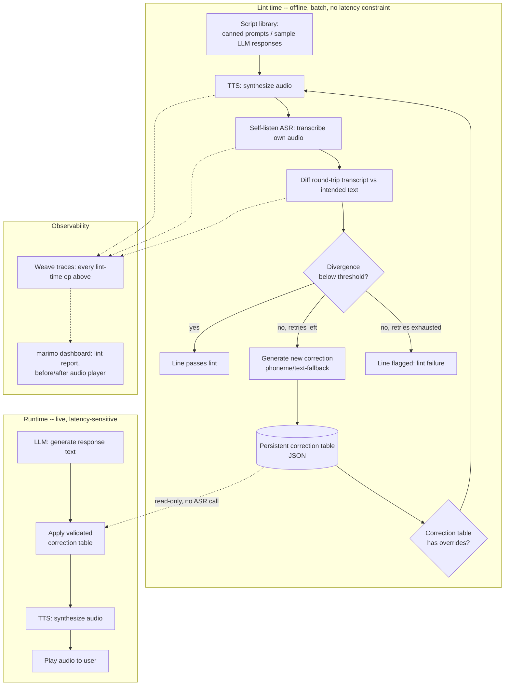

# Voice Pronunciation CI Linter — CoreWeave Hacks (Sep 12-13, 2026)

A build-time QA tool for voice agents: before a bot's canned prompts/scripts
ever reach production, run each one through a self-listen check (synthesize
→ transcribe the synthesized audio → diff against the intended text), catch
mispronunciations, and auto-generate a validated pronunciation correction
lexicon. The runtime voice agent never pays for any of this -- it just plays
audio using the pre-validated corrections, so there's zero added latency on
a live call.

## Business scenario

**Primary vertical: pharmacy / telehealth refill IVR.** Voice bots that read
back drug names (refill reminders, prior-auth notices, pharmacist callback
lines) have a sharper failure mode than generic voice bots: a mispronounced
or confused drug name isn't just embarrassing, it's a known patient-safety
issue. The FDA and ISMP maintain running lists of "look-alike, sound-alike"
(LASA) drug name pairs precisely because confusion between similar-sounding
names (e.g. hydroxyzine/hydralazine, Celebrex/Celexa) causes real dispensing
errors. A pharmacy's `TRAP_WORDS` list is literally its drug formulary --
every name it dispenses gets checked before a script goes live.

This isn't theoretical for this project: we tested 21 real drug names
against the actual pipeline (Google Cloud TTS + self-listen ASR). 19/21 came
back clean. Two -- **Rybelsus** and **Vraylar** -- came back genuinely
mangled ("ribelisys", "VRAYER"), failed after 3 retries, and were correctly
flagged for human review with auto-generated phonetic fallbacks. See
`scripts/sample_prompts_pharmacy.txt` / `data/lint_report_pharmacy.json`.

**General problem (any voice AI system):** the TTS voice mispronounces a
name, brand, or technical term, and nobody notices until a customer hears it
on a live call. Today the fix is reactive -- an engineer has to notice the
complaint, then manually add a pronunciation-dictionary entry.

This flips that from *reactive* to *shift-left*: like a spell-checker or
linter that runs in CI before code ships, this runs before a voice bot's
scripts ship. Feed it the bot's canned prompt library (or a batch of
LLM-generated responses used in testing); it flags every line where the TTS
voice is likely to be misheard, and produces a corrected pronunciation table
the bot loads at runtime. A failing line can even fail the build, the same
way a linter error would.

**Why this avoids the latency problem a live/runtime version has:** the
expensive part (TTS → self-listen ASR → diff → retry loop) only ever runs
offline, against a script library, with no user waiting on the other end.
At runtime, the voice agent does a single TTS call using whatever correction
the lint step already validated -- no self-listen ASR call, no retry loop,
no added latency versus a plain TTS integration.

## The pipeline

**Lint time (offline, no latency constraint):**
1. Read a script library: canned prompts / LLM response samples the voice
   agent might say.
2. For each line: **TTS synthesizes** the audio.
3. **Self-listen step:** feed that synthesized audio back through ASR to get
   a "what a listener would actually hear" transcript.
4. **Compare** the round-trip transcript against the intended text:
   - Word-level diff (Levenshtein / WER via `jiwer`)
   - Flag mispronunciations of names, numbers, acronyms, domain terms
5. **Decision gate:**
   - Divergence below threshold → line passes, log success.
   - Divergence above threshold → generate a correction (SSML `<phoneme>`
     override or plain-text substitution), re-synthesize and re-check
     (bounded retry, max 2-3 attempts). If still diverging after retries,
     the line is flagged as a lint failure for a human to review.
6. **Log every attempt** (original text, audio, round-trip transcript, diff
   score, action taken) as a Weave trace so every lint run is fully visible
   and replayable, and every failing line has evidence attached.
7. **Persist the correction table:** once a word's fix is validated, it's
   stored permanently -- future lint runs (and the live runtime path) reuse
   it for free.

**Runtime (live, latency-sensitive):**
1. LLM generates a response (or a canned prompt is selected).
2. Apply the already-validated correction table (no ASR, no retry).
3. TTS synthesizes and plays -- a single API call, same latency as a voice
   agent with no pronunciation checking at all.


## Correction table

Each entry has two remediation strategies, tried in order:

```json
{
  "coreweave": {
    "phoneme_ipa": "kɔːɹˈwiːv",
    "text_fallback": "Core Weave"
  }
}
```

1. Try `<phoneme alphabet="ipa" ph="...">` first (if the TTS engine honors
   SSML phoneme overrides).
2. If the round-trip check still fails (or the engine ignores SSML, e.g.
   ElevenLabs), fall back to a plain-text substitution — no SSML needed,
   works on any engine since it's just different input text.

Phonetic spellings for the correction table can come from:
- Asking the LLM directly for an IPA transcription (cheap, decent for
  common words)
- A G2P library (`g2p_en`) or dictionary (CMUdict/ARPAbet, needs mapping to
  IPA)
- Hardcoded for known "trap words" ahead of the demo (most reliable)

## Stack

- **ASR:** Google Cloud Speech-to-Text (word-level confidence scores for the
  divergence check)
- **TTS:** Google Cloud TTS (full SSML incl. `<phoneme>`) — ElevenLabs has
  weak/no SSML support, use text-fallback path if using it
- **LLM:** Gemini via Vertex AI — response generation + "rewrite on failure" step
- **Tracing:** Weave (`weave.op()` around transcribe / generate / synthesize
  / self-check / rewrite)
- **Dashboard:** marimo notebook reading from Weave — plot correction rate
  over time, live audio player for before/after clips
- **Diffing:** `jiwer` (WER) or token-level Levenshtein + ASR confidence
  threshold

## Architecture



Key components:
- **Lint pipeline** (Script → TTS → Self-listen ASR → Diff → Gate): the same
  synchronous, bounded-retry loop as before, just run offline against a
  script library instead of blocking a live turn.
- **Correction table**: a small persisted JSON store, read at runtime (no
  ASR call, just a lookup) and written to only during lint runs. This is the
  bridge between the two halves: lint-time is where it's built, runtime is
  where it's consumed for free.
- **Runtime path**: a single TTS call using whatever the correction table
  already says -- no self-listen, no retry, no added latency versus a plain
  TTS integration.
- **Observability layer**: every lint-time stage wrapped in `weave.op()`;
  marimo reads the Weave client/API to render a lint report, decoupled from
  the runtime path entirely.

## Strengths

- **Best Loop Design:** the loop is self-contained and visually obvious —
  before/after audio of a mispronunciation getting caught and fixed live.
- **Best Use of Weave:** every attempt is a natural trace tree; dashboard
  shows error rate trending down as the correction table grows.
- **Most Production-Ready:** self-correction + persistent lexicon fixes are
  real production voice-system techniques, not a toy gimmick.
- **Best Social Media demo:** "watch the AI catch itself mispronouncing its
  own words" is a clean 30-second clip.
- **Cheap to demo reliably:** because trap words can be pre-selected, the
  "aha" moment doesn't depend on getting lucky with an organic model error.
- **Clear incremental build order:** each stage (pipeline → self-check →
  correction table → tracing → dashboard) is independently testable, so
  there's always a demoable state even if later stages run out of time.

## Weak spots / execution risks

- **Compounding ASR error, not just TTS error:** a round-trip mismatch could
  mean the *self-listen ASR* mis-heard correctly-pronounced audio, not that
  TTS was wrong. Mitigate by using the same (or a stronger) ASR model for
  self-listening as for user input, and by requiring the mismatch to persist
  across 2 consecutive self-listen passes before trusting it.
- **Lint coverage is only as good as the script library:** if a live LLM
  response says something never seen in the lint corpus, the runtime path
  has no correction for it (same blind spot a spell-checker has for words
  outside its dictionary). Mitigate by periodically lint-testing sampled
  live responses in a batch job, not just a fixed canned-prompt set, so
  coverage grows over time rather than staying frozen at whatever was
  linted once.
- **LLM-generated IPA may itself be wrong:** don't trust it blindly for the
  demo — pre-validate the phonetic spelling for your chosen trap words
  ahead of time; only rely on live LLM/G2P generation for the "looks
  organic" backup path, not the core demo moments.
- **SSML support varies by provider:** `<phoneme>` may be ignored (e.g.
  ElevenLabs) — confirm your chosen TTS provider's SSML support *before*
  building around it, and keep the text-fallback path as a first-class
  strategy, not an afterthought.
- **Alignment isn't always 1:1:** numbers/dates can be legitimately read
  multiple correct ways ("2026" as "twenty twenty-six" vs "two thousand and
  twenty-six") — a naive word-diff may flag correct variants as errors.
  Normalize known equivalence classes before diffing, or scope trap words to
  ones with an unambiguous correct reading (proper nouns are safer than
  numbers for this reason).
- **Word-level ASR confidence isn't available from every provider** (plain
  Whisper doesn't expose it natively; Google Cloud Speech-to-Text does via
  `enable_word_confidence`) — confirm the chosen ASR gives you what the diff
  logic needs before committing to it.
- **Retries can still be exhausted:** always have a defined "give up"
  behavior (play best-effort audio + log as unresolved) rather than letting
  the loop hang or the demo stall on a word that just won't fix.
- **Staged-looking demo risk:** judges may notice hardcoded trap words feel
  gimmicky — balance the planned trap-word moment with at least one
  genuinely unscripted/live example to show it generalizes.
- **Network dependency / API limits:** cloud ASR/TTS/LLM calls under
  hackathon wifi and rate limits are a real failure mode — have a local
  fallback (faster-whisper running locally) ready as a backup for the live
  demo.
- **Integration time sink:** Weave/marimo/ARIA wiring can eat hours if left
  to the end — scaffold tracing and the dashboard skeleton early (even with
  fake data) so it's just "plug in real data" later, not built from scratch
  under time pressure.

## MVP scope (~24hr hackathon)

- Batch lint processing over a script library (read line → lint → report),
  no streaming, no live user in the loop during the expensive part.
- Hardcode a small set of "trap words" (numbers, tricky names/acronyms) to
  reliably trigger visible corrections during the demo.
- Cap retries at 2 attempts per line to keep lint runs fast.
- Correction-table persistence as a simple JSON file keyed by word →
  override; nothing fancier needed. This is what the runtime path reads.
- A separate, deliberately minimal runtime playback path (no ASR, no retry)
  to make the "zero added latency live" claim concrete and measurable.
- Reserve the last few hours for the marimo dashboard (lint report) + a
  clean demo script: lint a script library → show the catch + fix → show
  the runtime path replaying the same line with no self-listen call at all.

## Sponsor fit

- **Weave (W&B):** primary tracing backbone — wrap every pipeline stage in
  `weave.op()`, use Weave's UI/API as the source of truth for "error rate
  over time" instead of building custom logging. This is the most direct
  path to **Best Use of Weave** and also strengthens the Loop Design and
  Production-Ready story (real observability, not printouts).
- **ARIA (W&B in-app coding agent):** two possible roles — (a) use ARIA
  *during* the hackathon to help scaffold/debug the pipeline faster, and/or
  (b) fold ARIA into the product itself as the "critic" that reviews a
  rewrite candidate before it's re-synthesized (e.g., ARIA checks the
  rewritten sentence still preserves meaning). Option (b) is the stronger
  submission for **Best Use of ARIA** since it's part of the shipped loop,
  not just a dev tool.
- **marimo:** build the live dashboard here instead of a static notebook —
  reactive cells re-render as new Weave traces come in, with an embedded
  audio player for before/after clips. If GPU-hungry (local Whisper/G2P),
  use molab's free cloud GPUs so the dashboard doesn't depend on a laptop's
  local compute. Targets **Best Use of marimo**.
- **TypeSafe AI:** TypeSafe's System One models (Choice/Score/Noul) are
  judgment primitives, not free-text generators, so they don't fit
  "generate a correction" -- they fit deciding *between* already-generated
  candidates. Used as a `Choice` critic inside the lint retry loop: given a
  phoneme override that still diverged, judge whether escalating to the
  plain-text fallback is actually likely to help, instead of blindly always
  escalating (this caught and fixed a real regression during testing).
  Targets **Best Use of TypeSafe AI** with a genuine, narrow judgment call.
- **CoreWeave GPU compute:** if running ASR/TTS models locally (e.g.
  faster-whisper, an open TTS model) rather than pure API calls, hosting
  them on CoreWeave infra reinforces the **Most Production-Ready** angle
  (self-hosted, not just API-glue).
- **Okta (judge expertise, optional stretch):** if time allows, scope the
  agent's own tool credentials (e.g., correction-table write access) with
  short-lived, purpose-specific tokens rather than a blanket key — a small
  add-on that plays to a specific judge's stated focus (non-human identity)
  without being core to the loop.

## Execution timeline (mapped to actual event schedule)

**Day 1 — Saturday**
- 9:00–10:30 — breakfast, finalize idea/team, repo scaffolding (this plan)
- 10:30–11:15 — kickoff talk (attend)
- 11:15–13:15 — build the linear pipeline end-to-end with no self-check yet
  (ASR1 → LLM → TTS → playback); confirm each provider actually works and
  pick TTS provider based on real SSML support test
- 13:15–15:15 — implement self-listen round-trip (ASR2) + diff/WER scoring
  + decision gate
- 15:15–17:15 — implement correction table (JSON persistence), phoneme +
  text-fallback remediation, bounded retry loop
- 17:15–18:30 — wrap all stages in Weave traces; sanity-check traces show up
  correctly
- 18:30–19:00 — dinner
- 19:00–21:00 — scaffold marimo dashboard skeleton (even with fake/sample
  data if Weave integration isn't finished); pick and pre-validate trap
  words + their IPA spellings

**Day 2 — Sunday**
- 9:00–10:30 — connect marimo dashboard to live Weave data; end-to-end test
  with real trap words
- 10:30–11:30 — stretch goals if time allows: ARIA-as-critic, TypeSafe
  structured correction-entry generation, local-fallback ASR for
  network resilience
- 11:30–12:30 — bug buffer + record a backup demo video (in case live
  audio/wifi fails on stage)
- 12:30–13:00 — finalize submission materials, polish demo script
- 13:00 — submissions due
- 13:30 — judging begins (be ready to run the live demo twice if asked)
- 15:30 — project presentations
- 16:30 — awards

## Demo script

1. Run the linter against `scripts/sample_prompts_pharmacy.txt` -- a
   pharmacy refill IVR script library containing real drug names (Rybelsus,
   Vraylar) known to trip up the TTS.
2. Show the round-trip ASR catching the mismatch (live trace in Weave/marimo
   lint report) -- "Rybelsus" heard back as "ribelisys", the correction
   being generated, retried, and the TypeSafe critic judging whether to
   escalate.
3. Show the validated correction landing in the persistent correction table.
4. Show the **runtime path** speaking the same line: a single TTS call, no
   ASR, no retry -- same latency as a plain TTS integration -- because the
   correction was already validated at lint time.
5. Zoom out: this is what a pharmacy would run in CI on every script/prompt
   change, with `TRAP_WORDS` seeded from their drug formulary -- catching
   patient-safety-relevant mispronunciations before they ever reach a call.
