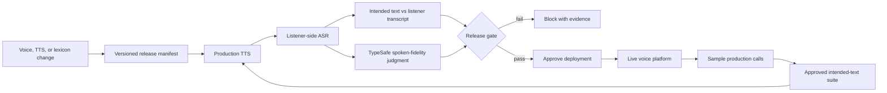

# Voice AI Quality Gate: Demo and Company Plan

## Status

This document records the reviewed direction for expanding the working pharmacy
demo. The routing and additional live agents described below are **planned but
not yet implemented**.

The current pharmacy assistant, its Vapi configuration, the phone number
`+1 (945) 242-9560`, and the existing FastAPI routes must keep working while
the new system is built beside them.

## Product thesis

Voice agents are moving from demos into workflows involving medication,
travel, payments, insurance, scheduling, and customer identity. Teams can
inspect the text sent to TTS, but that does not prove what a caller will hear.

Every quality-gate run preserves three distinct artifacts:

1. Approved intended text supplied to TTS.
2. Audio synthesized by the configured voice and correction lexicon.
3. The listener-side transcript recovered from that audio.

The gate catches only TTS pronunciation and spoken-fidelity failures. Prompt
correctness, agent hallucinations, business facts, conversation policy, tool
calls, and routing correctness are explicitly outside its scope.

**Voice AI Quality Gate is CI for TTS output.** Before approved lines ship, it
synthesizes them with the production voice, listens through ASR, detects
pronunciation or meaning loss caused by speech generation, retries validated
pronunciation corrections, and blocks unresolved audio failures with evidence.

The product checks:

- Pronunciation of medication names, brands, people, places, and technical terms.
- Preservation of numbers, dates, currency, percentages, acronyms, and negation.
- Intelligibility of the synthesized audio as observed by listener-side ASR.
- Regressions caused by a voice, TTS provider, model, or pronunciation-lexicon change.

The product does not decide whether the input text itself is true.

## Demo thesis

The demo must prove one clear claim:

> Approved text can look correct and still sound wrong. Our quality gate hears
> the TTS failure before a customer does, blocks the voice release, validates a
> pronunciation repair, and preserves before/after evidence.

The strongest demo is a release workflow, not three unrelated phone bots.
Pharmacy, travel, and banking demonstrate that the same gate applies across
industries while each agent retains its own policies and tests.

## One-number silent keypad routing

### Caller experience

```text
Call +1 (945) 242-9560
        |
        |-- press 1 --> Pharmacy agent greets the caller
        |-- press 2 --> Travel agent greets the caller
        `-- press 3 --> Banking agent greets the caller
```

There is no spoken receptionist, menu, transfer announcement, or shared
"quality lab" persona. The presenter knows the digit mapping. The first voice
the audience hears belongs to the selected business agent.

### Supported Vapi mechanism

Vapi's `keypadInputPlan` receives caller DTMF. After the input timeout, Vapi
adds an entry such as `User's Keypad Entry: 1` to the conversation. This is
different from Vapi's DTMF tool, which sends tones to an external system.

The internal DTMF router will:

1. Connect without speaking.
2. Wait for one caller keypress.
3. Map `1`, `2`, or `3` to a fixed assistant destination.
4. Invoke a handoff immediately.
5. Emit no transfer messages.
6. Let the destination assistant speak its own normal first message.

Planned keypad configuration:

```json
{
  "keypadInputPlan": {
    "enabled": true,
    "timeoutSeconds": 1,
    "delimiters": ""
  }
}
```

The route must be deterministic. A custom model endpoint or equivalent fixed
dispatcher should translate only these exact keypad messages into handoff tool
calls:

```python
ROUTES = {
    "1": "pharmacy-assistant-id",
    "2": "travel-assistant-id",
    "3": "banking-assistant-id",
}
```

An LLM must not infer the destination from an open-ended description. Invalid
or absent input should remain silent briefly and allow another keypress; it
must never fall through to an arbitrary agent.

### Isolation and rollback requirements

- Reuse the existing pharmacy assistant without changing its dialogue.
- Build and test travel and banking assistants before changing the number.
- Save the current phone-number, assistant, and squad JSON configurations
  before every Vapi mutation.
- Validate routing with a temporary web-call configuration or direct assistant
  tests before assigning the phone number to the router/squad.
- Change the existing phone-number assignment only after all three destinations
  pass their release suites.
- Keep a one-command or one-request rollback to the current pharmacy assistant.
- Do not delete or replace the working phone number.

## The stage demo

### Act 1: Show the hidden risk

Start with a candidate release that looks correct as text. Run the quality gate
and play the customer-heard audio. The gate catches a real failure and marks
the release **BLOCKED** with:

- expected text and structured facts,
- listener-side transcript,
- failed assertion,
- before audio,
- trace of every decision,
- proposed or selected repair.

The pharmacy `Farxiga` example is the fast, audible hook. It should lead into
the broader point immediately: pronunciation is merely the easiest failure to
hear on stage.

### Act 2: Prove cross-industry voice fidelity

Run the same release gate against three industry suites:

| Suite | Voice checks | Example blocking defect |
| --- | --- | --- |
| Pharmacy | medication and dosage pronunciation | `Vraylar` heard as `regular` |
| Travel | airline, route, date, and time intelligibility | flight number or departure time misheard |
| Banking | APR, currency, and payment intelligibility | `5.9%` heard as `59%` |

Each test compares approved intended text with listener-side ASR. Deterministic
assertions protect critical spoken tokens; TypeSafe judges whether the audio
transcript preserves the intended spoken meaning despite harmless formatting.

### Act 3: Repair and release

Apply one controlled correction, rerun the same suite, and show the release
moving from **BLOCKED** to **APPROVED**. The dashboard should compare the two
runs and preserve both sets of evidence in Weave.

The repair can be a pronunciation entry, prompt revision, voice/provider
change, or policy rule. It must be shown as a versioned release artifact rather
than an unexplained live-model retry.

### Act 4: Call what passed

Call the single number three times and press `1`, `2`, and `3`. Each business
agent should demonstrate one short scenario that was just approved by the
gate. This links the test evidence to the live phone experience.

The live call is proof of deployment. The quality-gate run is the product.

## Product workflow



### Release manifest

Every run should identify the exact system under test:

- Git commit and test-suite version
- voice platform and assistant ID
- prompt/workflow version
- model, transcriber, and TTS provider/version
- voice and pronunciation lexicon version
- tool configuration and environment
- thresholds and policy-pack version

Without this manifest, a passing report cannot prove which agent was tested.

### Test-case contract

A scalable case should contain approved intended text, critical words or spoken
forms that must survive synthesis, forbidden mishearings where useful, semantic
fidelity requirements, thresholds, and artifact-retention policy.

### Decision hierarchy

Use the least ambiguous evaluator available:

1. Exact normalized assertions for critical spoken terms, dates, money, and acronyms.
2. Normalized comparisons for equivalent spoken forms.
3. Acoustic and pronunciation checks for configured critical terms.
4. TypeSafe judgments for intended-text-to-transcript meaning preservation.
5. Human review for low-confidence, high-risk, or novel failures.

No probabilistic judge should overrule a failed deterministic safety fact.

## Why this can become an inevitable company

The durable market is not "better pronunciation." It is the growing gap
between how quickly companies can change voice agents and how slowly they can
prove those changes are safe.

As voice agents become cheaper and more autonomous:

- more teams deploy them,
- each team runs more agents and more call flows,
- model, prompt, voice, and provider updates happen more frequently,
- regulated workflows demand evidence and auditability,
- production mistakes become more expensive,
- manual call review stops scaling.

That makes an independent verification layer increasingly necessary. The
company wins by becoming the system that answers: **Can this voice-agent
version ship?**

### Initial wedge

Sell release testing for high-stakes outbound and inbound voice workflows in
healthcare, financial services, insurance, and travel. Begin with teams already
using Vapi or similar platforms and shipping prompt/voice changes without a
repeatable audio-level regression suite.

The first paid product can be simple:

```text
Connect assistant -> define critical scenarios -> run on every change
-> receive PASS/BLOCK evidence -> approve deployment
```

### Expansion path

1. **CI release gate:** API, CLI, and GitHub checks for pre-production suites.
2. **Provider matrix:** compare voices, models, and transcribers against the
   same cases before migration.
3. **Production monitoring:** sample real calls, redact sensitive data, and
   turn novel failures into regression tests.
4. **Policy packs:** reusable healthcare, banking, insurance, collections, and
   travel checks maintained with domain experts.
5. **Release control plane:** deployment approvals, canaries, rollback signals,
   audit exports, and quality budgets across every voice agent.

### Compounding advantages

- A growing library of real failure patterns and normalized spoken
  equivalences.
- Provider-neutral benchmark data across ASR, TTS, voices, and models.
- Customer-specific regression history that improves test coverage over time.
- Trusted policy packs and audit evidence embedded in release processes.
- Integrations with voice platforms, CI systems, observability tools, and
  regulated deployment workflows.

The moat is not a single evaluator or prompt. It is the accumulated test
corpus, failure taxonomy, release history, integrations, and customer trust.

## What not to build yet

- Another general-purpose voice-agent platform
- A spoken receptionist for the demo number
- An autonomous production fixer that changes regulated agents without review
- A giant pronunciation dictionary for arbitrary caller names
- A dashboard with no release decision or reproducible evidence behind it
- Custom telephony infrastructure while Vapi can support the demo
- Broad compliance claims before policy packs are validated by domain experts

## Implementation sequence after approval

### Phase 1: Product-shaped offline demo

1. Convert the existing voice cases into a versioned intended-text schema.
2. Add deterministic critical-term and forbidden-mishearing checks.
3. Add a release manifest and explicit `APPROVED` or `BLOCKED` result.
4. Show run-to-run comparison and evidence in the marimo dashboard.
5. Preserve all evaluator traces in Weave.

Exit criterion: one real TTS pronunciation regression blocks for the correct
reason, the repaired audio passes, and both runs are reproducible.

### Phase 2: Three destination agents

1. Leave pharmacy unchanged.
2. Implement a focused travel conversation using the validated itinerary.
3. Implement a focused banking conversation using validated APR/payment facts.
4. Give each agent a separate endpoint or explicit model identifier while
   sharing common TTS, tracing, and quality-gate infrastructure.
5. Run each destination directly before introducing routing.

Exit criterion: all three assistants pass their own suites and can be called
directly without the router.

### Phase 3: Silent routing

1. Create the internal silent DTMF router.
2. Enable single-digit keypad input with a short timeout.
3. Configure fixed handoff destinations and empty handoff messages.
4. Test `1`, `2`, `3`, invalid input, no input, and repeated input.
5. Assign the existing number only after those tests pass.
6. Make real calls and verify Vapi records, transcripts, selected destination,
   destination greeting, and absence of router speech.

Exit criterion: ten consecutive routing attempts choose the expected agent,
with no audible router or transfer message and a verified rollback path.

### Phase 4: Investor/customer-shaped proof

1. Add a small adapter interface for a second voice platform.
2. Run a provider or voice comparison using the same release suite.
3. Generate a concise audit report suitable for a release approver.
4. Interview five voice-agent teams about their latest production failure,
   current QA process, release frequency, and willingness to pay for blocking
   checks.

Exit criterion: at least two design partners provide real anonymized regression
cases or agree to pilot the gate in their release process.

## Immediate demo checklist

- [ ] Freeze and export the working pharmacy/Vapi configuration.
- [ ] Clean up and commit the generic quality-gate prototype separately.
- [x] Define the release manifest and test-case schema.
- [ ] Create one reproducible TTS pronunciation or spoken-fidelity failure per industry. Pharmacy Vraylar is complete.
- [x] Make BLOCKED -> repair -> APPROVED visible in marimo and Weave.
- [ ] Build and directly validate travel and banking assistants.
- [ ] Build and validate the silent DTMF router.
- [ ] Assign the existing number only after rollback is tested.
- [ ] Rehearse the complete demo with cached evidence as a network fallback.

## Success metrics

For the demo:

- Every planned defect is caught for the intended reason.
- Every approved scenario has audio, transcript, assertions, and a manifest.
- The same repaired release passes twice with the same decision.
- Keypad routing succeeds ten consecutive times without router speech.
- The full stage sequence completes in under four minutes.

For an initial product pilot:

- Time to connect an existing agent and run its first suite
- Critical regressions caught before production
- False-block rate and human-review rate
- Coverage of production intents and critical business facts
- Mean time from failed check to verified repair
- Percentage of releases carrying reproducible approval evidence

## One-sentence company description

**Voice AI Quality Gate tests what callers actually hear and blocks unsafe
voice-agent releases before they reach production.**